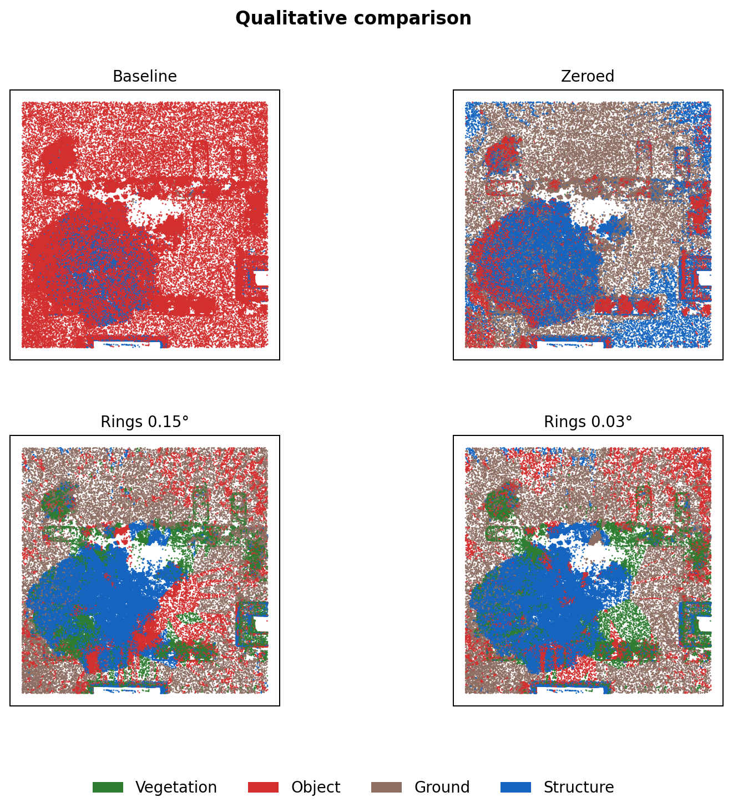
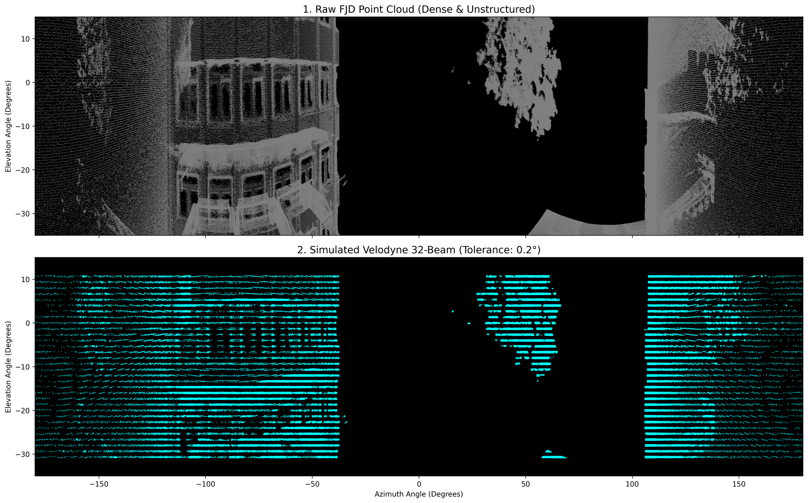

# LiDAR Semantic Segmentation Across Sensor Domains

Can a model trained on automotive LiDAR data produce useful semantic labels for a dense terrestrial scan **without retraining**? This project explores that question using a pretrained [Point Transformer V3 (PTv3)](https://github.com/Pointcept/Pointcept) model trained on nuScenes and point clouds acquired with an FJD Trion S1 scanner.

The work was developed as a *Project Work* assignment at Fachhochschule Dortmund (2025–2026). Rather than training a new model, it examines how **input intensity, point-cloud sampling geometry, and label grouping** affect predictions when a pretrained model is applied outside its original sensor domain.

**Main finding:** On a hand-labeled subset of the project scan, the best tested preprocessing configuration increased **four-class mIoU from 5.29% to 16.84%**. Absolute performance remained low, especially on the **Object** class. The results demonstrate an improvement relative to the tested baseline, **not reliable cross-sensor segmentation**.

## Qualitative comparison



*Predictions for the four tested configurations. Colors indicate Vegetation (green), Object (red), Ground (brown), and Structure (blue). This is a visual comparison of predictions, not a ground-truth overlay. Figure reproduced from the author's project report (Figure 5.5).*

## Approach

The pretrained PTv3 checkpoint predicts **16 nuScenes semantic classes**. The pipeline adapts its inputs and optionally groups the output classes into four broader categories:

```text
FJD Trion S1 LAS point cloud
        |
        v
5 cm voxel subsampling + overlapping 30 m x 30 m tiles (15 m stride)
        |
        v
Inference-time input modification
  - original or zeroed intensity
  - optional ring-like geometric downsampling
        |
        v
Pretrained PTv3 inference on individual tiles (16 classes)
        |
        v
Softmax-based aggregation of overlapping tile predictions
        |
        v
Reconstructed LAS of the subsampled scene
  - 16 original prediction classes
  - 4 mapped superclasses
```

The **intensity masking** experiment replaces the intensity channel with zero. The **ring-sampling** experiment filters points by elevation angle to approximate the sparser scan pattern of a 32-beam spinning LiDAR. It is an approximation of sensor sampling, not a physically accurate simulation of the source sensor. The model weights remain unchanged throughout the experiments. Ground-truth labels are used **for evaluation**, not fine-tuning.



*Illustrative sampling comparison (0.2° tolerance), reproduced from Figure 4.2 of the project report. The actual ablation experiments used 0.15° and 0.03° tolerances.*

The 16 classes are mapped into **Vegetation**, **Object**, **Ground**, and **Structure** for the four-class evaluation and visualization. See [`scripts/class_mappings.py`](scripts/class_mappings.py) for the exact mapping.

## Experiments and results

Four inference configurations were compared on a **manually labeled subset of tiles from the project scan**. The table below reports the stored **four-class** results from [`results_ablation/`](results_ablation/).

| Configuration | Intensity channel | Ring sampling | Four-class mIoU |
| --- | --- | --- | ---: |
| 1 — Baseline | Original intensity | None | 5.29% |
| 2 | Zeroed | None | 10.87% |
| 3 | Zeroed | Approximate rings, 0.15° tolerance | **16.84%** |
| 4 | Zeroed | Approximate rings, 0.03° tolerance | 15.55% |

Masking intensity was associated with an improvement over the baseline, and the 0.15° ring-sampling configuration had the highest reported score. The 0.03° configuration performed slightly worse, consistent with useful geometry being discarded by more aggressive sampling. These comparisons are limited to the tested scan and evaluation subset.

The performance differences are uneven across classes. In the best configuration, **Structure** reached 38.48% IoU, while **Object** reached only 2.62%. This remains a challenging transfer setting even when the aggregate metric improves.

**Experimental results:** The metrics presented here were obtained during the original experiments in March 2026. Subsequent maintenance corrected the original-class evaluation and improved experiment reproducibility. The original prediction files and annotated data are no longer available for recalculation, so the historical results have been preserved without modification. The four-class results are not expected to be affected by the identified confusion-matrix issue. The revised code has been tested using synthetic data, but end-to-end GPU inference hasn't been revalidated.

## Running the pipeline

### Requirements and reproducibility status

- Linux and Docker (as invoked by the current Makefile), with an NVIDIA CUDA-capable GPU supported by the container stack.
- A source point cloud in LAS/LAZ format. The original FJD Trion S1 data and manually labeled evaluation subset are **not included**.
- The nuScenes PTv3 pretrained checkpoint, saved as `weights/ptv3_nuscenes.pth`. Obtain it from the [Pointcept model repository](https://huggingface.co/Pointcept/PointTransformerV3/tree/main/nuscenes-semseg-pt-v3m1-0-base); weights are not redistributed here.
- The [`Makefile`](Makefile) currently contains settings specific to the original development machine, including **UID/GID `1003:1003`**, GPU device bindings, host driver-library paths, and a default input filename. **Update those settings before running on another machine.** This is not yet verified as a fresh-clone one-command installation.

The project was developed using PyTorch 2.7 / CUDA 12.8 and an NVIDIA RTX 5090. Different GPU architectures may require changes to the container build.

### 1. Build the environment

```bash
make build
```

### 2. Tile an input point cloud

Place a scan at `data/raw_las/scan.las` (or provide another path):

```bash
make tile SRC_LAS=data/raw_las/scan.las
```

### 3. Run inference

For zeroed intensity:

```bash
make infer FEATURE_MODE=zero
```

For the best tested configuration:

```bash
make infer FEATURE_MODE=zero SIM_VELODYNE=1 VELODYNE_TOL=0.15
```

Inference writes per-tile outputs to `data/predictions/` (or the configured `OUTPUT_DIR`). When simulated rings are enabled, random point thinning uses a configurable random seed (`--seed`, default `42`).

### 4. Reconstruct the scene

```bash
make reconstruct SRC_LAS=data/raw_las/scan.las
```

Outputs:

- `data/reconstructed.las`: predictions mapped to four superclasses.
- `data/reconstructed_original_classes.las`: original 16-class predictions.

These files describe the **voxel-subsampled scene**, not an exact per-point labeling of every point in the original high-density LAS. The semantic predictions are stored in a `semantic_label` field, which can be inspected in CloudCompare.

### Evaluation and utilities

The original four-configuration evaluation sequence is in [`scripts/run_ablation.sh`](scripts/run_ablation.sh), and the metric implementation is in [`scripts/calculate_miou.py`](scripts/calculate_miou.py). Repeating the quantitative experiments requires hand-labeled PLY tiles under `data/ground_truth_labeled_tiles/` with the `scalar_segmentation` attribute; those evaluation files are not part of the public repository.

Other available Makefile targets: `check_tile`, `viz_preds`, `viz_3d`, `export_ply`, and `dev`. Some still reference original-scan filenames and require updating for a new input.

## Limitations

- **Domain shift persists.** A model trained on automotive scans has difficulty with a dense, static terrestrial point cloud; especially weak performance on the Object superclass remains unresolved.
- **Narrow evaluation.** Results are from a hand-labeled subset of the project's scan, not a large independent benchmark or a multi-scanner generalization study.
- **Lossy preprocessing.** Voxelization and geometric thinning discard data; the ring pattern is only a sampling approximation.
- **Incomplete external reproducibility.** Original scan, labels, and pretrained weights are not stored in this repository; environment dependencies are not fully pinned, though random seeds and pipeline validation are now configurable.

A logical next step would be to evaluate against a broader annotated target-domain dataset and consider supervised fine-tuning. Neither is part of the results claimed here.

## Repository layout

```text
configs/             PTv3 inference configuration
src/preprocessing/   Point-cloud preprocessing and tiling
scripts/             Inference, reconstruction, metrics, visualizations
results_ablation/    Saved evaluation CSVs
Containerfile        CUDA / PyTorch / Pointcept environment
Makefile             Entry points for pipeline tasks
```

## Credits and license

The segmentation model and upstream framework are from [Pointcept](https://github.com/Pointcept/Pointcept); the pretrained checkpoint is not redistributed. This repository's source code is available under the [MIT License](LICENSE). Figures used here were extracted from the author's project report and should only be made public if sharing the underlying scan visualizations is permitted.
